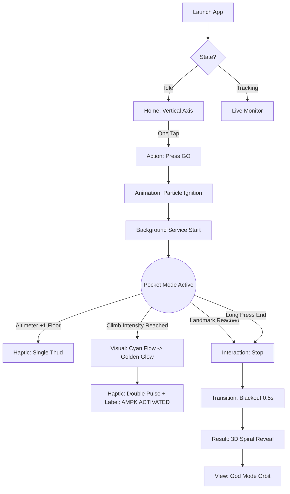
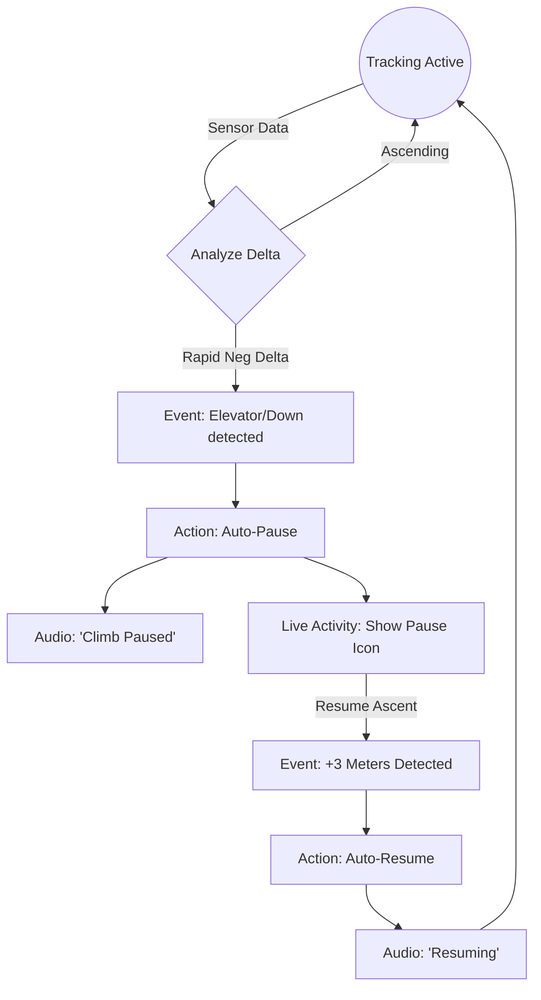
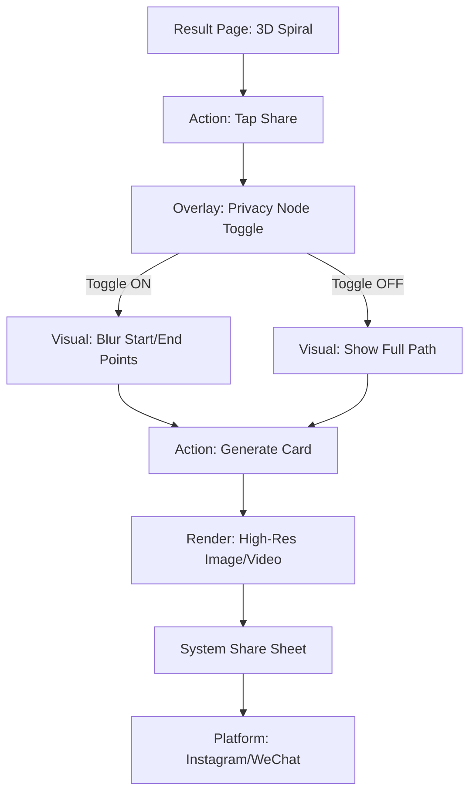

---
stepsCompleted:
  - step-01-init
  - step-02-discovery
  - step-03-core-experience
  - step-04-emotional-response
  - step-05-inspiration
  - step-06-design-system
  - step-07-defining-experience
  - step-08-visual-foundation
  - step-09-design-directions
  - step-10-user-journeys
  - step-11-component-strategy
  - step-12-ux-patterns
  - step-13-responsive-accessibility
  - step-14-complete
  - metabolic-pivot-update
inputDocuments:
  - /Users/fanhua/plan/vertical/_bmad-output/planning-artifacts/prd.md
---

# UX Design Specification - Vertical

**Author:** Fanhua
**Date:** 2026-01-17

---

<!-- UX design content will be appended sequentially through collaborative workflow steps -->

## Executive Summary

### Project Vision

Vertical 将爬楼梯重构为“垂直维度的生理激活工具”。基于 AMPK 代谢干预理念，通过“数据美学”和“3D 可视化”，将碎片化的楼梯攀爬转化为高效的代谢干预与城市探险。

### Target Users

- **High-Achievers (Liam)**: 追求数据精准度与社交炫耀，偏好硬核科幻风 (Cyberpunk/Minimalist)。
- **Fragmented Fit (Sarah)**: 追求无感记录与零操作，偏好智能反馈与清晰指引。

### Key Design Challenges

1.  **Metabolic Feedback Clarity**: 如何直观、实时地告知用户“AMPK 激活”这一生理状态，而不增加认知负担。
2.  **Immersive Feedback in Boring Contexts**: 在封闭的楼梯间创造沉浸感，需依赖强视觉（粒子流、动态模糊）和听觉（TTS, Haptics）。
3.  **Visualizing the Invisible**: 如何将不可见的“气压变化”和“代谢水平”转化为直观的、美观的视觉实体。

### Design Opportunities

- **The "Vertical Axis" Metaphor**: 打破传统 Tab Bar 结构，采用以“垂直轴”为核心的无限流主界面。
- **Living Data**: 让数据“活”过来。VAM 不只是数字，而是粒子流动的速度；高度不只是米数，而是视角的提升。

## Core User Experience

### Defining Experience

Vertical 的核心体验是非侵入式的伴随（Invisible Companion）与爆发式的奖赏（Explosive Reward）的结合。

- **Pre-Workout**: 极简的一键启动，垂直轴隐喻激发攀登欲望。
- **During-Workout**: 零干扰，依靠 Haptics 和 Audio 提供隐形反馈。
- **Post-Workout**: 3D 视觉盛宴，将枯燥数据转化为可触摸的艺术品。

### Platform Strategy

- **Primary**: iOS/Android Native App。
- **Key Capabilities**:
  - **Live Activities**: 锁屏即看数据。
  - **Haptic Engine**: 用震动传递“高度感”和“节奏感”。
  - **Background Location**: 确保锁屏下 GPS 和气压计的连续记录。

### Effortless Interactions

1.  **Smart Pausing**: 自动识别下楼/电梯，无需人工干预。
2.  **Privacy Shield**: 自动隐藏敏感地理位置节点。
3.  **One-Tap Start**: 从冷启动到开始记录，不超过 1 次点击。

### Critical Success Moments

1.  **The Landmark Unlock**: 当高度匹配地标时的全感官（视/听/触）反馈。
2.  **The Spiral Reveal**: 运动结束时，首次看到本次 3D 轨迹生成的瞬间。

### Experience Principles

1.  **Vertical Flow**: 交互逻辑沿垂直轴线展开，强化“向上”心智。
2.  **Cinematic Data**: 用电影感的镜头语言展示运动数据。
3.  **Metabolic Rewards**: 将代谢干预过程（AMPK 激活）视觉化为能量爆发。
4.  **Silence is Gold**: 除非必要（达成成就/异常状态），否则不打扰用户。

## Desired Emotional Response

### Primary Emotional Goals

1.  **Stoic Heroism (斯多葛式的英雄主义)**: 在攀爬过程中，营造一种冷静、克制、与自我对话的氛围。拒绝花哨的卡通激励，使用冷峻的工业/科幻美学。
2.  **Architectural Awe (建筑学的惊叹)**: 在结果展示时，通过宏大的 3D 视角，让用户感受到自己运动轨迹的空间美感。

### Emotional Journey Mapping

- **Trigger**: 被“垂直轴”界面的无限延伸感所吸引，产生“向上”的冲动。
- **Action**: 在攀爬的痛苦期，通过极简的 Haptics 陪伴，不打扰但同在，建立战友般的信任。
- **Reward**: 登顶瞬间的视听爆发，以及分享卡片生成的“专属感”，满足虚荣心与自我实现。

### Micro-Emotions

- **Anxiety -> Trust**: 对“数据是否准确”的怀疑，通过灵动岛的实时跳动数字消除。
- **Boredom -> Immersion**: 对“楼梯间无聊”的厌倦，通过“虚拟地标”的进度映射（“你已到达自由女神火炬处”）转化为沉浸感。

### Design Implications

- **Visuals**: 使用深色模式 (Dark Mode)，高对比度荧光色（Neon），配合粒子系统 (Particles)，营造 Cyberpunk 氛围。
- **Audio**: 语音播报不应是热情的教练音，而应是冷静的 AI 助手音（类似 Jarvis 或 HAL 9000）。
- **Haptics**: 震动质感要“重”且“短”，模拟心跳或脚步的坚实感。

## UX Pattern Analysis & Inspiration

### Inspiring Products Analysis

- **Zenly (Map Aesthetics)**: 借鉴其将地理位置转化为情感连接的能力，以及“点亮地图”的收集机制。
- **Monument Valley (Visual Style)**: 借鉴其“几何极简主义”和“等轴测视角”，用于 3D 地标的低多边形 (Low-poly) 渲染。
- **iOS Weather (Immersive Data)**: 借鉴其背景随数据（天气）变化的沉浸感。Vertical 的背景色应随高度变化（从地面的深灰过渡到平流层的深蓝）。

### Transferable UX Patterns

1.  **Vertical Timeline Axis**: 将主导航设计为一根无限延伸的垂直线，刻度代表高度。这是 App 的视觉脊梁。
2.  **Gamified Unlocking (Fog of War)**: 所有高级地标初始状态为“锁定/剪影”，通过累积高度解锁。
3.  **Live Activities**: 利用锁屏实时活动展示当前高度，减少解锁手机的操作负担。

### Anti-Patterns to Avoid

1.  **Dashboard Overload**: 拒绝在首页堆砌过多数据卡片。首页 = 垂直轴 + 下一个目标。
2.  **Aggressive Social**: 拒绝强制社交绑定。保持“孤独攀登者”的调性。

### Design Inspiration Strategy

- **Adopt**: Zenly 的点亮机制 + Keep 的语音陪伴。
- **Adapt**: 将 Timeline 的时间维度改为空间（高度）维度。
- **Avoid**: 传统运动 App 的复杂仪表盘设计。

## Design System Foundation

### 1.1 Design System Choice

**"Vertical OS" (Custom Hybrid System)**
基于 SwiftUI/Compose 原生框架，叠加自定义的 **Cyberpunk Minimalist** 视觉皮肤。这是一个“重视觉、轻交互”的混合系统，UI 充当 3D 世界的 HUD (Head-Up Display)。

### Rationale for Selection

1.  **Performance First**: 必须保证 60fps 的 3D 渲染，Web 类框架 (React Native/Flutter) 在此时可能存在性能瓶颈或桥接损耗，原生框架是最佳选择。
2.  **Immersive Experience**: 标准的 iOS/Android 控件（大白底、圆角）会破坏“孤独攀登”的沉浸感。需要一套黑底、锐利、高对比度的 HUD 界面。
3.  **Data Readability**: 使用工业级字体和高亮色，确保在运动颠簸中只需一瞥即可读取数据。

### Implementation Approach

- **Layering**: 背景层 (3D Live View) -> 蒙版层 (Glassmorphism) -> 数据层 (Neon Text/HUD)。
- **Typography**: 主要数字采用等宽字体 (Monospaced)，标题采用无衬线粗体。
- **Motion**: 用“瞬间切换”代替“缓动过渡”，强调数字的跳动感和机械感。

### Customization Strategy

- 不使用任何现成的 UI Kit (如 Material Design)，而是建立一套极简的 Custom Components：
  - `NeonButton`: 发光边框按钮。
  - `VerticalSlider`: 用于调节目标高度的垂直滑块。
  * `DataHUD`: 半透明数据悬浮窗。

## 2. Core User Experience Mechanics

### 2.1 Defining Experience

**"The Metabolic Heartbeat" (代谢的心跳)**
一种基于物理位移的生理反馈。App 是感官的延伸，将高度变化和代谢强度（AMPK 激活）转化为触觉（Haptics）和听觉（Audio）的实时反馈。

### 2.2 User Mental Model

- **From**: "Trudging up stairs" (Heavy, Boring, Repetitive).
- **To**: "Ascending the Spire" (Epic, Progress-oriented, Gamified).

### 2.3 Success Criteria

- **Blind Usability**: 用户可以在不看屏幕、不解锁手机的情况下，准确感知当前进度（层数/Landmark）。
- **Instant Gratification**: 每爬一层 (<3米) 必须给予明确反馈，延迟 < 1秒。
- **Emotional Climax**: 结束时的 3D 轨迹展示必须足够震撼，抵消运动的疲惫感。

### 2.4 Novel UX Patterns

- **Pocket Mode UI**: 专为锁屏/口袋场景设计的交互模式，依赖震动编码（单震=层数增加，双震=目标达成）传达信息。
- **Vertical Scroller**: 模拟飞行器的高度表，作为主导航核心。

### 2.5 Experience Mechanics

- **Ignition**: "GO" 按钮转变为粒子流，视觉上暗示“向上”的动能。
- **The Pulse**: 爬升过程中的“心跳式”震动反馈。
- **The Reveal**: 结束后的电影级“黑屏 -> 爆发”转场，展示 3D 螺旋。

## Visual Design Foundation

### Color System (Cyberpunk/Neon)

=0

- **Backdrop**: `Midnight (#050505)` to `Abyss (#000000)` gradient.
- **Accents**:
  - `Cyan (#00F0FF)`: Primary Action & VAM.
  - `Lime (#39FF14)`: Success & Altitude Gain.
  - `Pink (#FF0099)`: Heart Rate & Milestones.
  - `Gold (#FFD700)`: **AMPK Activated State**. 用于最高级别的代谢反馈。
- **Transparency**: 广泛使用 `Opacity 20%-40%` 的 Glassmorphism 来构建 HUD 层，确保不遮挡背后的 3D 场景。

### Typography System

- **Hero Data (VAM/Height)**: `Monospaced` (SF Mono / JetBrains Mono). 确保数字跳动的机械稳定性。
- **Labels (Landmarks)**: `Condensed Sans` (DIN / Roboto Condensed). 具有工业铭牌的即视感。
- **Size Scale**: 夸张的对比度。核心数据极大 (48pt+)，次要标签极小 (12pt)，剔除中间态。

### Spacing & Layout Foundation

- **The Spine Interaction**: UI 元素不依靠传统的“左对齐/右对齐”，而是**吸附于屏幕垂直中轴线**。
- **Vertical Whitespace**: 使用大面积的垂直留白来模拟“高空稀薄感”。
- **Touch Targets**: 尽管视觉极简，但所有可点击区域（透明热区）至少保持 `48x48pt`。

### Accessibility Considerations

- **Contrast**: 霓虹色在纯黑背景下拥有极佳的对比度 (AAA级)，非常适合户外强光或楼梯间暗光环境。
- **Haptic Reinforcement**: 对于视障用户，依靠震动频率的变化来传达“上升速度”和“地标到达”，实现无视觉操作。

## Design Direction Decision

### Design Directions Explored

1.  **The Spire (Architectural)**: 极简线条与精密标尺，如同建筑蓝图。
2.  **Neon Runner (Cyberpunk)**: 激进的荧光色与粗体描边字，如同赛车 HUD。
3.  **Deep Space (Zen)**: 粒子悬浮与中心仪表，如同深潜雷达。

### Chosen Direction

**V1: The Spire (Architectural) + V3 Elements**
选择以 **"The Spire"** 的布局结构为核心，融合 **"Deep Space"** 的微光粒子氛围。

- **Core**: 保持垂直标尺 (Axis) 作为视觉脊梁。
- **Atmosphere**: 在极简线条背景下，增加随 VAM 速度变化的粒子流，打破纯静态的僵硬感。

### Design Rationale

- **Alignment**: "The Spire" 最完美地契合了 "Vertical" 的产品名和“征服地标”的隐喻。
- **Clarity**: 相比 Cyberpunk 风格，蓝图风格的数据可读性更高，且更耐看（不容易产生视觉疲劳）。

### Implementation Approach

- **Component**: 使用 `Canvas/Metal` 绘制精细的垂直标尺刻度。
- **Effect**: 粒子系统层级置于 UI 之下，仅作为环境氛围，不抢夺数据焦点。

## User Journey Flows

### Journey 1: The Climbing Loop (核心爬升)

- **Key**: 极简的启动（One Tap）和震撼的结尾（Reveal）。中间过程完全隐形化。
- **Flow**: Launch -> GO -> Pocket Mode (Haptics) -> Stop -> 3D Reveal.

### Journey 2: The Auto-Pause (智能干预)

- **Key**: 零交互。用户不需要拿出手机操作暂停，完全依赖传感器判断。
- **Flow**: Detect Downward -> Auto Pause -> Detect Upward -> Auto Resume.

### Journey 3: The Viral Share (社交闭环)

- **Key**: 隐私前置。在分享前明确且直观地处理地理位置隐私。
- **Flow**: View 3D -> Hide Privacy Nodes -> Generate Cinematic Card -> Share.

### Flow Optimization Principles

1.  **Zero-Friction Start**: 启动应用到开始记录，不需要任何配置（目标/模式等默认沿用上次或智能推荐）。
2.  **Trust through Feedback**: 自动暂停时必须给语音反馈，消除用户“它因为我坐电梯而把我也算进去了吗”的疑虑。
3.  **Privacy by Default**: 分享卡片默认开启“隐藏节点”，保护家庭住址。

## Component Strategy

### Design System Components (Native)

- **Container**: `LazyVStack` / `RecyclerView` (Performance).
- **Overlay**: System Permissions & Share Sheet.

### Custom Components (Vertical OS)

#### 1. VerticalAxisView (Core Navigation)

- **Purpose**: 无限滚动的垂直标尺，用于浏览未来地标和回顾历史高度。
- **Anatomy**: 左侧刻度线 + 右侧地标标签 + 此刻位置游标 (Current Cursor)。
- **Behavior**: 惯性滚动 (Inertial Scrolling)，自动吸附到最近的地标刻度。

#### 2. LiveHUD (Data Layer)

- **Purpose**: 运动状态下的核心仪表盘。
- **Anatomy**:
  - Primary: VAM (Medium Font).
  - Primary Hero: Current Altitude (Giant Illuminated Font).
  - Status: AMPK Indicator (Capsule Badge + Progress Bar).
- **States**: Idle (Dimmed) -> Active (Neon Cyan) -> Metabolic Activation (Neon Gold/Yellow Gradient).

#### 3. ParticleBackground (Atmosphere)

- **Purpose**: 视觉化“速度”和“高度”。
- **Tech**: Metal (iOS) / Canvas or Shader (Android).
- **Logic**:
  - 粒子流速 = VAM / 100。
  - 粒子色彩 = 混合蓝色 (Standard) -> 金黄色 (AMPK Activated).

### Implementation Strategy

- **Composition**: 采用 "Z-Layer Archetype"：
  - Layer 0: `ParticleBackground` (GPU Rendered).
  - Layer 1: `VerticalAxisView` (Scrollable).
  * Layer 2: `LiveHUD` (Fixed Overlay).
  * Layer 3: `SystemOverlay` (Alerts/Sheets).

## UX Consistency Patterns

### Button Hierarchy

- **Primary (Neon Pulse)**: 用于核心转化（Start, Share）。特征为荧光色外发光 + 呼吸动画。
- **Secondary (Ghost Wire)**: 用于辅助功能。特征为 1px 极细描边，点击态为实心填充。
- **Safety (Long Press)**: 用于结束/删除操作。必须长按 3 秒，防止运动中误触。

### Feedback Patterns

- **Haptic Coding**: 建立一套不依赖视觉的震动语言。
  - `Tap` = Selection.
  - `Heavy Thud` = Floor Climbed.
  - `Double Pulse` = Landmark/Goal Reached.
- **Audio Ducking**: 语音播报时自动压低背景音乐音量，播报结束后平滑恢复。

### Navigation Patterns (The Axis)

- **Single Source of Truth**: 屏幕右侧的垂直刻度尺是唯一的时空导航器。
- **Temporal Scroll**:
  - 上滑 = 预览未来 (Targets)。
  - 下滑 = 回溯历史 (History)。
  - 双击刻度 = 回到此刻 (Now)。

### Immersive Transitions

- **Seamless Zoom**: 所有的页面跳转不使用“推入/弹出”动画，而是使用 **Zoom In/Out**。
  - 点击地标 -> 镜头拉近进入 3D 详情。
  - 返回 -> 镜头拉远回到垂直轴。

## Responsive Design & Accessibility

### Device Strategy

- **Mobile Only**: 仅针对竖屏手机进行布局优化。不适配 iPad/Desktop。
- **Dynamic Island First**: 将灵动岛作为 "Second Screen"，用于显示最高频的实时数据（高度/心率）。
- **Android Adaptation**: 在 Android挖孔屏机型上，在相同位置渲染一个持久化的黑色胶囊条 (Persistent Capsule) 以统一体验。

### Physical Ergonomics

- **Thumb Zone**: 核心操作区（Start/Stop）严格限制在屏幕底部 30% 区域。
- **Anti-Shake**: 按钮点击判定区 (Hit Slop) 扩大至 64pt，防止运动中误触或点不到。

### Accessibility (A11y)

- **VoiceOver/TalkBack**: 为自定义的 `Canvas` 组件提供完整的 Accessibility Tree 映射。让视障用户也能“听”懂垂直轴。
- **Haptic Substitution**: 对于听障用户，所有的关键语音提示（如 "Halfway There"）必须同步伴随特定的震动模式。
- **High Contrast**: 默认保持超高对比度 (Neon on Black)，满足 WCAG AAA 标准。

## Statistics Page UI Breakdown (Retrospective View)

**Goal**: Transform raw time-series data into a "Metabolic Legacy" dashboard that feels premium, scientific, and motivating.

### 1. View Architecture

采用 **"The Periodic Table" (周期表)** 布局逻辑，顶部为时间轴切换，中部为核心摘要，底部为深度图表。

- **Header Layer**: `SegmentedControl` (D, W, M, 6M, Y) + 周期总高度汇总。
- **Insight Layer**: 核心指标卡片流 (Horizontal Scroll or Grid)。
- **Visual Layer**: 核心图表区 (Altitude Chart & Zone distribution)。
- **Bottom Layer**: 智能建议与 AMPK 科学内容入口。

### 2. Detailed Component Specs

#### Component A: The Timeframe Switcher (`StatsSegmentedControl`)

- **Visual**: Cyberpunk 风格的细边框切换器，选中项带有 Neon Glow。
- **Interaction**: 点击触发 Haptic `selectionChanged`，图表通过异步数据流刷新。

#### Component B: Insight Summary Cards (`MetricCard`)

仿苹果健康 "Summary" 的精简版，但视觉更硬核。

- **Card 1: "7-Day Pulse"**: 展示过去 7 天平均爬升高度，通过对比色显示增减百分比。
- **Card 2: "Peak Intensity"**: 展示本周期内最高 $HRR\%$ 达到的区间。
- **Card 3: "Mito Score"**: 累计的线粒体指数（75%-90% $HRR\%$ 分钟数）。

#### Component C: Main Altitude Chart (`AltitudeBarChart`)

- **Type**: `SwiftCharts` Bar Mark.
- **Visual**: 渐变色柱状图（从底部的 Cyan 到顶部的 Lime）。
- **Scrubbing**: 用户指尖滑动时，实时更新顶部的日期和具体数值数值，并触发轻微的 Haptic `step`。

#### Component D: Metabolic Quality Map (`ZoneDistributionChart`)

- **Type**: Stacked Horizontal Bar or Donut Chart.
- **Visual**: 四种颜色代表不同代谢区间：
  - **Blue**: Recovery / Base.
  - **Cyan**: Fat Oxidation.
  - **Pink**: Glucose Uptake.
  - **Gold**: AMPK / Autophagy Zone.
- **Legend**: 指引用户点击进入 "AMPK Science Board" 深入了解指标含义。

### 3. Design Principles for Statistics

1. **Consistency of Colors**: 图表中的颜色必须与运动实时的 HUD 颜色完全一致。
2. **"Empty State" Motivation**: 当数据不足时，展示地标剪影作为占位符，提示“还差 X 米解锁碎片”。
3. **Cinematic Transitions**: 切换时间维度时，柱状图应带有平滑的伸缩动画（Spring Animation），而不是瞬间跳变。

### 4. Technical Integration (TCA)

- **State**: `StatsFeature.State` 维护当前选择的时间跨度及同步后的数据模型。
- **Action**: `statsEffect` 负责从 `DatabaseClient` 异步查询、去重并转换成 `ChartModel`。
- **View**: 使用 `SwiftCharts` 实现 60fps 的交互性能。
